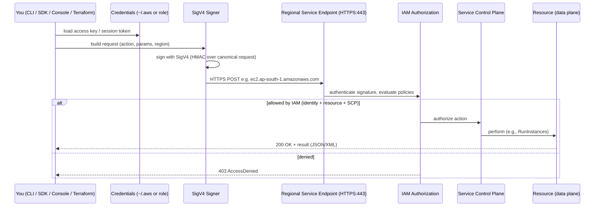

# Amazon Web Services for Site Reliability & Platform Engineers
### A Production Handbook — From Beginner to Principal Engineer

---

# Chapter 1 — Foundations of AWS and the Global Infrastructure

> *"Everything fails, all the time."* — Werner Vogels, CTO of Amazon. Designing on AWS begins with accepting this and engineering around it.

---

## How to Read This Book

This handbook applies a consistent 20-part template to every chapter. From Chapter 2 onward, each chapter is a **single AWS service or domain** (IAM, VPC, EC2, S3, RDS, EKS, Lambda, CloudWatch, and so on), and the template maps onto it cleanly: you will *install* its tooling, walk *every* configuration field, learn *every* relevant CLI command, integrate it with Terraform and Kubernetes, work through 30+ production troubleshooting scenarios, and drill 25–50 interview questions.

Chapter 1 is the **foundation chapter**. You cannot deeply understand EC2 placement, S3 durability, RDS Multi-AZ, or cross-region DR without first understanding the substrate they all run on: AWS's global infrastructure, its API/control-plane model, the shared responsibility model, the account and identity boundary, and how you talk to AWS at all (CLI, SDK, IaC). Where a template section is inherently service-specific (e.g., the 30-issue troubleshooting deep-dive), this chapter covers the *foundational* version and forward-maps the rest to the dedicated chapter. Nothing is skipped; it is placed where it belongs.

> **Currency note:** AWS publishes new Regions and services constantly. Where this chapter cites counts (Regions, Availability Zones), treat them as a snapshot — the authoritative live figure is always on the AWS Global Infrastructure page. As of this writing AWS reports 39 launched Regions, each with multiple Availability Zones, with roughly 120 Availability Zones across 38–39 geographic Regions globally. The *concepts* below are stable; only the integers move.

---

## 1. Introduction

### 1.1 Why AWS (and Cloud) Exists

Before cloud, running software meant owning the machines. An organization that wanted to launch a product had to forecast peak demand months in advance, raise capital, buy servers, rent rack space in a data center, run power and cooling, hire people to wire and patch and replace failing disks, and then *hope* the forecast was right. If you under-provisioned, your launch fell over under load and you lost customers. If you over-provisioned — the rational choice, since outages are visible and idle capacity is not — you paid for expensive hardware that sat at 10–15% utilization for years. Either way, capital was locked up, lead times were measured in weeks or months, and the undifferentiated heavy lifting of running infrastructure consumed engineering attention that should have gone into the product.

Amazon itself felt this pain acutely as an e-commerce company with extreme seasonal spikes (Black Friday, holiday shopping) sitting on top of a baseline of ordinary traffic. Internally, Amazon had built reusable infrastructure services and standardized how teams provisioned compute and storage. The insight that became a multi-hundred-billion-dollar business was that *this capability was itself the product*: if Amazon could rent infrastructure to itself on demand, it could rent it to everyone, turning a cost center into a utility.

The result, **Amazon Web Services**, reframes infrastructure as a metered utility — like electricity. You do not build a power station to run a toaster; you plug into the grid and pay for what you use. Cloud applies the same logic to compute, storage, networking, and hundreds of higher-level services. The defining shift is from **capital expenditure (CapEx)** — buying assets up front — to **operational expenditure (OpEx)** — paying for consumption — combined with **elasticity**: capacity that grows and shrinks with demand in minutes, not months.

### 1.2 History

| Year | Milestone | Significance |
|---|---|---|
| 2003–2004 | Internal Amazon infrastructure standardization; the famous "API mandate" | Forces all teams to expose functionality only through service interfaces — the cultural seed of AWS |
| 2006 | Public launch of **S3** (storage), **SQS** (queuing), and **EC2** (compute) | The cloud era begins; on-demand servers by the hour |
| 2008–2009 | EBS, Elastic IPs, Auto Scaling, Elastic Load Balancing, CloudFront, RDS | The building blocks of a real production architecture appear |
| 2011–2014 | Multi-region expansion, IAM, VPC becomes default, Redshift, Lambda (2014) | Fine-grained identity, software-defined networking, and serverless |
| 2015–2018 | Aurora, ECS, EKS, Fargate, the Well-Architected Framework formalized | Managed databases and containers; reliability codified as guidance |
| 2019–present | Graviton (Arm) processors, Outposts, Local Zones, Wavelength, ever-expanding Regions | Custom silicon, hybrid and edge; the footprint keeps growing |

Two pieces of history shape how you should *think* about AWS:

- **The API mandate.** Amazon's internal decree that all teams communicate only through hardened service interfaces means AWS is, at its core, **a set of APIs**. Every console click, every CLI command, every Terraform `apply` ultimately becomes a signed HTTPS API call to a service endpoint. Internalize this early: *to operate AWS at a principal level is to think in API calls and IAM permissions, not in web-console buttons.*
- **Primitives over platforms.** AWS historically shipped small, composable primitives (a queue, an object store, a VM) and let customers assemble them, rather than shipping monolithic platforms. This is why AWS has 200+ services that interlock — power and flexibility at the cost of a steep learning curve. This book's job is to flatten that curve.

### 1.3 Real Business Use Cases

- **Elastic web/mobile backends.** Handle a 50× traffic spike during a product launch or sale by autoscaling EC2/containers/Lambda, then scale back down and stop paying when it ends.
- **Startups with no CapEx.** Launch a global product on a credit card, defer infrastructure spend until you have revenue, and reach customers on multiple continents from day one.
- **Enterprise migration / data-center exit.** Move legacy workloads off owned hardware to reduce CapEx, improve DR posture, and modernize incrementally.
- **Big data and ML.** Spin up a 500-node analytics cluster for four hours, pay for four hours, and tear it down — economically impossible with owned hardware.
- **Disaster recovery.** Use AWS as a warm/cold standby for on-premises systems, paying for full DR capacity only when you actually fail over.
- **SaaS platforms.** Multi-tenant products that need global reach, per-tenant isolation, and pay-as-you-grow economics.
- **Regulated industries.** Use Region selection and compliance attestations to meet data-residency and audit requirements (covered in the *Security & Compliance* chapter).

### 1.4 When to Use AWS

Choose AWS (or any major cloud) when **most** of these hold: your demand is variable or unpredictable; you value speed-to-market over hardware ownership; you want global reach without building global data centers; you want to consume managed services (databases, queues, ML) instead of operating them; you need strong DR/HA without building a second data center; or your team is small relative to the operational surface you must cover.

### 1.5 When *Not* to Use AWS (Honestly)

A Principal Engineer names the limits:

- **Steady, predictable, high-utilization workloads at large scale** can be *cheaper on owned hardware.* If you run thousands of servers at 80%+ utilization 24/7 for years, the cloud premium may exceed CapEx amortization. (Several large companies have repatriated workloads for exactly this reason.) The cloud's elasticity is a discount on variability; if you have no variability, you are paying for an option you do not exercise.
- **Strict data-sovereignty or air-gapped requirements** that no Region or sovereign-cloud offering satisfies.
- **Ultra-low-latency local processing** (factory floor, vehicle) where even edge offerings add unacceptable round-trips — though Outposts/Local Zones/Wavelength narrow this gap.
- **Lock-in-averse strategies** where the cost of deep coupling to proprietary services outweighs the convenience. (Mitigate with open standards — Kubernetes, Postgres, Terraform — rather than avoiding cloud entirely.)
- **Tiny, static, trivial workloads** where a $5 VPS or a static host is simpler and cheaper than navigating AWS's surface area.

### 1.6 Comparison With Alternatives

| Dimension | On-Premises | AWS | Microsoft Azure | Google Cloud (GCP) |
|---|---|---|---|---|
| Cost model | CapEx, depreciate | OpEx, pay-per-use | OpEx, pay-per-use | OpEx, pay-per-use |
| Provisioning time | Weeks–months | Minutes | Minutes | Minutes |
| Breadth of services | You build it | Largest (200+) | Very broad; strong enterprise/MS integration | Strong data/ML/Kubernetes heritage |
| Market position | — | Largest market share | Strong in enterprise/hybrid | Differentiated on data & K8s (GKE) |
| Identity model | LDAP/AD | IAM | Entra ID (Azure AD) | Cloud IAM |
| Best fit | Stable, regulated, high-util | General-purpose, broadest ecosystem | Microsoft-centric enterprises | Data/analytics/ML, K8s-native |
| Networking default | Physical | VPC | VNet | VPC |

The honest summary: for most organizations the choice between the three hyperscalers is driven more by existing relationships, talent, and specific managed services than by raw capability — all three are excellent. AWS's advantage is **breadth and maturity**; its disadvantage is **complexity** born of that same breadth. This book teaches AWS, but the architectural reasoning (HA, DR, least privilege, IaC, observability) transfers to any cloud.

### 1.7 Advantages

Elasticity (match capacity to demand in minutes); breadth (a managed service for almost every need, reducing what you must operate); global reach (deploy near users worldwide); pay-as-you-go economics (no CapEx, stop paying when you stop using); a deep partner/tooling ecosystem; strong security and compliance posture *for the parts AWS owns*; and rapid innovation (new capabilities ship constantly).

### 1.8 Disadvantages and Trade-offs

- **Cost complexity.** Pay-per-use can surprise you. Egress charges, idle resources, and the sheer number of billable dimensions make cost management a discipline of its own (the *Cost Optimization* chapter).
- **Surface area / complexity.** 200+ services with deep interdependencies is a steep learning curve and a large security attack surface to reason about.
- **Lock-in risk.** Deep use of proprietary services (DynamoDB, Lambda, Step Functions) is productive but couples you to AWS. This is a *deliberate trade-off*, not a mistake — but make it consciously.
- **Shared responsibility confusion.** Many breaches stem from customers misunderstanding what AWS secures versus what they must secure (see §2.5). The cloud is secure*able*, not automatically secure.
- **Abstraction leakage.** Managed does not mean magic; an RDS instance still has a disk that can fill, and Lambda still has cold starts. You must understand the internals to operate at scale.

### 1.9 Architecture Overview (Conceptual)

Hold this mental model for the entire book. AWS is a layered system, and almost everything you will learn slots into one of these layers:

```
   ┌───────────────────────────────────────────────────────────────┐
   │  YOUR APPLICATIONS & DATA                                       │
   │  (you are responsible for security IN the cloud)               │
   ├───────────────────────────────────────────────────────────────┤
   │  AWS MANAGED SERVICES                                           │
   │  Compute (EC2, Lambda, ECS/EKS) · Storage (S3, EBS, EFS)       │
   │  Databases (RDS, Aurora, DynamoDB) · Networking (VPC, ELB,     │
   │  Route 53, CloudFront) · Observability (CloudWatch) · Security │
   │  (IAM, KMS, Secrets Manager) · Integration (SQS, SNS, EventBridge)│
   ├───────────────────────────────────────────────────────────────┤
   │  CONTROL PLANE (the AWS APIs)                                   │
   │  Every action = a signed HTTPS API call to a regional endpoint │
   │  Gatekept by IAM. This is how the console, CLI, SDK, IaC all   │
   │  actually talk to AWS.                                          │
   ├───────────────────────────────────────────────────────────────┤
   │  GLOBAL INFRASTRUCTURE                                          │
   │  Regions → Availability Zones → Data Centers                   │
   │  + Edge Locations, Local Zones, Wavelength, Outposts           │
   │  (AWS is responsible for security OF the cloud)                │
   └───────────────────────────────────────────────────────────────┘
```

The dividing line between the bottom two layers (AWS's) and the top two (yours) **is the shared responsibility model**, the single most important governance concept in cloud security. We return to it in §2.5.

---

## 2. Internal Architecture of AWS

### 2.1 The Hierarchy: Regions, Availability Zones, Data Centers

AWS's physical world is organized as a strict hierarchy. Master this vocabulary; it underlies every HA and DR decision in later chapters.

```
   AWS (global)
     │
     ├── Region  (e.g., ap-south-1 = Mumbai, us-east-1 = N. Virginia)
     │     │   • a physical geographic area
     │     │   • isolated & independent from other Regions
     │     │   • has its own service endpoints & (mostly) its own data
     │     │
     │     ├── Availability Zone  (e.g., ap-south-1a, ap-south-1b, ap-south-1c)
     │     │     │   • one or more discrete data centers
     │     │     │   • independent power, cooling, physical security
     │     │     │   • interconnected by low-latency, redundant fiber
     │     │     │
     │     │     └── Data Center (one or more per AZ)
     │     │
     │     └── (each Region has a minimum of 3 AZs)
     │
     ├── Edge Locations  (CloudFront CDN, Route 53, global acceleration)
     ├── Local Zones     (compute/storage near a metro, outside a full Region)
     ├── Wavelength      (compute embedded in telecom 5G networks)
     └── Outposts        (AWS hardware in YOUR data center)
```

The critical engineering facts, each of which drives architecture:

- A **Region** is an *isolation and data-residency boundary.* Each AWS Region consists of a minimum of three isolated and physically separate AZs within a geographic area. Data you put in Mumbai stays in Mumbai unless you explicitly copy it elsewhere — this is how you meet data-sovereignty law. Regions fail independently; a Region-wide event in `us-east-1` does not touch `eu-west-1`.
- An **Availability Zone** is a *fault-isolation boundary within a Region.* Each AZ has independent power, cooling, and physical security and is connected via redundant, ultra-low-latency networks. AZs are placed far enough apart that a single disaster (fire, flood, power loss) is unlikely to take out more than one, yet close enough (typically tens of kilometers) that synchronous replication between them is viable. **Spreading across AZs is the fundamental high-availability move in AWS** — an EC2 fleet in three AZs survives the loss of an entire data center.
- AZ names are **per-account randomized.** Your `us-east-1a` and my `us-east-1a` may be different physical zones. AWS does this to balance load and prevent everyone from piling into "the first one." When you need a *stable* physical reference (e.g., for cross-account placement), use the **AZ ID** (`use1-az1`) rather than the AZ name.
- Newer Regions are **opt-in.** To use a Region introduced after March 20, 2019, you must enable the Region before you can access it; earlier Regions are enabled by default.

### 2.2 Edge, Local Zones, Wavelength, Outposts

Beyond the Region/AZ core, AWS extends toward the user and into the customer's premises:

- **Edge Locations** — hundreds of points of presence running CloudFront (CDN) and Route 53 (DNS), caching content close to users to cut latency. The data plane for global content delivery.
- **Local Zones** — extensions of a Region placed in a metro that lacks a full Region, offering single-digit-millisecond latency for things like live media production and gaming. AWS Local Zones place compute, storage, database, and select services closer to end-users; each Local Zone is an extension of an AWS Region.
- **Wavelength** — AWS compute embedded inside telecom carriers' 5G networks for ultra-low-latency mobile/edge apps.
- **Outposts** — physical AWS racks installed in *your own* data center, running AWS APIs on-premises for hybrid and low-latency or data-residency workloads. The same control plane, your floor space.

### 2.3 The Control Plane: AWS Is an API

Everything in AWS is an API call. The console is a web app that calls APIs; the CLI is a program that calls APIs; Terraform and CloudFormation are programs that call APIs. Understanding the request lifecycle demystifies the entire platform.



Key takeaways embedded in that flow:

- **Endpoints are regional.** `ec2.ap-south-1.amazonaws.com` is a different endpoint from `ec2.us-east-1.amazonaws.com`. A few services are *global* (IAM, Route 53, CloudFront, billing) and effectively anchored in `us-east-1`. When a command "does nothing" or "can't find" a resource, the cause is very often the wrong Region — the resource exists, just in another Region's endpoint.
- **Authentication is SigV4.** Every request is cryptographically signed (HMAC-SHA256 over a canonical form of the request) using your credentials. You rarely sign by hand — the CLI/SDK do it — but knowing it explains why clock skew, wrong Region, or bad credentials produce signature errors.
- **Authorization is IAM**, evaluated as a layered decision (identity policy + resource policy + permission boundary + Organization SCP). The default is **deny**; an explicit deny anywhere wins. This is the subject of Chapter 2 and the most security-critical topic in the book.
- **Control plane vs data plane.** Creating/modifying/listing resources is the *control plane* (e.g., `RunInstances`, `CreateBucket`); using the resource is the *data plane* (e.g., sending packets to the instance, `GetObject` on the bucket). They scale and fail independently — a control-plane outage may stop you launching new instances while running instances keep serving traffic.

### 2.4 Ports, Protocols, and Endpoints

| Layer | Protocol / Port | Notes |
|---|---|---|
| AWS API calls | HTTPS / TCP **443** | All control-plane traffic; TLS-encrypted; SigV4-signed |
| SSH to Linux EC2 | TCP **22** | Prefer SSM Session Manager (no open port) over raw SSH |
| RDP to Windows EC2 | TCP **3389** | Same — prefer SSM |
| Web workloads | TCP **80 / 443** | Behind ELB; terminate TLS at the load balancer or instance |
| RDS (Postgres/MySQL) | TCP **5432 / 3306** | Reachable inside the VPC; never expose publicly |
| VPC internal | Private IPv4/IPv6 | Software-defined; governed by route tables, SGs, NACLs |
| Private API access | **VPC Endpoints** (PrivateLink) | Reach AWS APIs without traversing the public internet |

A production principle to plant now: **the best open port is no open port.** Modern AWS access patterns (SSM Session Manager, VPC endpoints, private subnets) aim to eliminate inbound ports entirely. We build this out in the *VPC* and *EC2* chapters.

### 2.5 The Shared Responsibility Model

This is the governance backbone of AWS security and the source of most cloud breaches when misunderstood.

```
   ┌──────────────────────────────────────────────────────────┐
   │  CUSTOMER — responsible for security *IN* the cloud        │
   │  • Your data (classification, encryption choices)         │
   │  • IAM users/roles/policies & least privilege             │
   │  • OS patching on EC2, app code, app-level auth           │
   │  • Network/firewall config (Security Groups, NACLs)       │
   │  • Encryption configuration, key usage                    │
   └──────────────────────────────────────────────────────────┘
   ─────────────────  the responsibility line  ────────────────
   ┌──────────────────────────────────────────────────────────┐
   │  AWS — responsible for security *OF* the cloud            │
   │  • Physical data centers, hardware, host hypervisor       │
   │  • The global network backbone                            │
   │  • Managed-service infrastructure (the RDS engine host,   │
   │    the S3 fleet, the Lambda execution substrate)          │
   └──────────────────────────────────────────────────────────┘
```

The line **moves depending on the service abstraction**:

- **EC2 (IaaS):** AWS secures the hypervisor and below; *you* patch the guest OS, configure the firewall, and secure the app. Maximum control, maximum responsibility.
- **RDS (PaaS/managed):** AWS patches and operates the database engine host; you still control access, encryption settings, and the data. Less responsibility than EC2.
- **S3 / Lambda / DynamoDB (serverless):** AWS operates almost everything; you are responsible chiefly for *access configuration and your data.* The infamous "public S3 bucket" breach is always a *customer* misconfiguration, never an AWS failure — AWS provided the lock; the customer left it open.

The Principal-level lesson: **the cloud gives you secure building blocks, but security is a property you must configure, not a default you inherit.** Most headline "AWS breaches" are customer-side misconfigurations on the upper half of this diagram.

### 2.6 Performance, Scalability, Limitations

- **Performance** is dominated by *placement*: keep chatty components in the same AZ to minimize latency and inter-AZ data-transfer cost; put users' content at edge locations; choose a Region near your users.
- **Scalability** is effectively unbounded for most services *if you design for it* — stateless, horizontally scalable, autoscaled, and spread across AZs. The constraint is usually your architecture, not AWS.
- **Service quotas (limits).** Every service has soft and hard quotas (e.g., default VPCs per Region, EC2 vCPUs per family, Lambda concurrency). Soft quotas can be raised via Service Quotas; hard limits cannot. *Quota exhaustion is a top-five cause of production incidents* (you cannot launch instances during a scale-up event because you hit a vCPU quota). Track quotas proactively — covered per service throughout the book.
- **Eventual consistency.** Some operations (and historically some S3 read-after-write patterns, now strongly consistent) and many control-plane propagations (IAM changes, DNS, security-group rules) are *eventually consistent.* Newly created credentials or roles may take seconds to propagate globally; build retries and tolerate brief propagation delays.

---

## 3. Installation — Talking to AWS

You interact with AWS through four channels: the **Console** (web UI, good for learning and one-offs), the **CLI** (scriptable, the SRE's daily driver), **SDKs** (in your application code), and **IaC** (CloudFormation/Terraform/CDK — the only acceptable way to manage production at scale). This section installs the CLI everywhere the template requires. The current major version is **AWS CLI v2** (v1 is legacy; always install v2).

### 3.1 Linux / Ubuntu / Amazon Linux (x86_64)

```bash
# Download and install AWS CLI v2 (works on Ubuntu, Amazon Linux, most distros)
curl "https://awscli.amazonaws.com/awscli-exe-linux-x86_64.zip" -o "awscliv2.zip"
unzip awscliv2.zip
sudo ./aws/install            # installs to /usr/local/bin/aws
aws --version                 # verify: aws-cli/2.x.x Python/3.x ...
```

For **ARM/Graviton** hosts, swap the URL to `awscli-exe-linux-aarch64.zip`.

### 3.2 RHEL / CentOS / Rocky / Fedora

The same official zip installer works (it is distro-agnostic). Ensure `unzip` and `curl` exist first:

```bash
sudo dnf install -y unzip curl        # (or: sudo yum install -y unzip curl)
curl "https://awscli.amazonaws.com/awscli-exe-linux-x86_64.zip" -o "awscliv2.zip"
unzip awscliv2.zip && sudo ./aws/install
```

Avoid `dnf install awscli` from distro repos — it often ships the old v1.

### 3.3 Windows

```powershell
# Run as Administrator (PowerShell)
msiexec.exe /i https://awscli.amazonaws.com/AWSCLIV2.msi /qn
# then open a new terminal:
aws --version
```

Or download and run the `AWSCLIV2.msi` installer from the AWS site interactively.

### 3.4 macOS

```bash
curl "https://awscli.amazonaws.com/AWSCLIV2.pkg" -o "AWSCLIV2.pkg"
sudo installer -pkg AWSCLIV2.pkg -target /
aws --version
```

### 3.5 Docker

Use the official image to avoid installing anything on the host; mount your credentials read-only:

```bash
docker run --rm -it \
  -v ~/.aws:/root/.aws:ro \
  -v $(pwd):/aws \
  amazon/aws-cli:latest s3 ls
```

You can alias it for convenience:

```bash
alias aws='docker run --rm -it -v ~/.aws:/root/.aws:ro -v $(pwd):/aws amazon/aws-cli'
```

### 3.6 AWS CloudShell (zero install)

In the AWS Console, open **CloudShell** — a browser-based shell with the CLI, your credentials, and common tools pre-installed. Ideal for quick tasks and for environments where you cannot install software. Note its ephemeral storage and per-Region nature.

### 3.7 SDKs and IaC (forward map)

- **SDKs** (`boto3` for Python, AWS SDK for JavaScript/Java/Go, etc.) embed the same SigV4-signed API calls into your application. Installed via the language's package manager (`pip install boto3`, `npm install @aws-sdk/client-s3`).
- **IaC** — CloudFormation (native YAML/JSON), Terraform (HashiCorp, multi-cloud), and CDK (real programming languages compiling to CloudFormation) — are installed and used in depth in the **Infrastructure as Code** chapter. For production, *IaC is mandatory*; the CLI is for investigation and break-glass, not for clicking infrastructure into existence by hand.

---

## 4. Configuration

The CLI and SDKs read configuration from two files in `~/.aws/` (or `%USERPROFILE%\.aws\` on Windows), plus environment variables, plus instance/role metadata. Understanding the **credential provider chain** (the order in which credentials are resolved) prevents a large class of "why is it using the wrong account?" confusion.

### 4.1 `~/.aws/credentials` and `~/.aws/config`

```ini
# ~/.aws/credentials  — secrets live here
[default]
aws_access_key_id     = AKIAEXAMPLE
aws_secret_access_key = wJalrXUtnFEMI/K7MDENG/bPxRfiCYEXAMPLEKEY

[prod]
aws_access_key_id     = AKIAPRODEXAMPLE
aws_secret_access_key = ...secret...
```

```ini
# ~/.aws/config  — non-secret settings and profiles
[default]
region = ap-south-1
output = json

[profile prod]
region = us-east-1
output = table
# Assume a role instead of long-lived keys (best practice):
role_arn       = arn:aws:iam::111122223333:role/Admin
source_profile = default
mfa_serial     = arn:aws:iam::444455556666:mfa/saroj
```

| Setting | Meaning | Best practice |
|---|---|---|
| `region` | Default Region for commands | Set explicitly; never rely on guessing |
| `output` | `json` / `table` / `text` / `yaml` | `json` for scripting, `table` for humans |
| `role_arn` + `source_profile` | Assume-role chaining | Prefer roles over static keys everywhere |
| `mfa_serial` | Require MFA for the profile | Mandatory for privileged profiles |
| `aws_access_key_id` / `_secret_` | Long-lived IAM user keys | **Avoid in production**; use roles/SSO |

### 4.2 AWS IAM Identity Center (SSO) — the modern way

For human access, long-lived keys are an anti-pattern. Configure short-lived SSO credentials:

```bash
aws configure sso
# prompts for SSO start URL, region, account, role
# then:
aws sso login --profile my-sso-profile
```

This issues temporary credentials that expire automatically — vastly safer than keys that live in a file forever.

### 4.3 The Credential Provider Chain (resolution order)

The CLI/SDK look for credentials in this order and use the first match:

```
1. Command-line options (--profile, --region)
2. Environment variables (AWS_ACCESS_KEY_ID, AWS_SECRET_ACCESS_KEY, AWS_SESSION_TOKEN)
3. CLI/SDK credentials file  (~/.aws/credentials)
4. CLI/SDK config file        (~/.aws/config, incl. SSO / assume-role)
5. Container credentials      (ECS task role)
6. Instance Metadata Service  (IMDS — the EC2 instance's IAM role)
```

The Principal-level rule that falls out of this: **on EC2/ECS/EKS, attach an IAM role and let step 5/6 supply credentials automatically — never bake access keys into an instance or container image.** Hard-coded keys in an AMI or a Git repo are the most common catastrophic AWS security failure.

### 4.4 Environment variables (useful for CI and overrides)

```bash
export AWS_PROFILE=prod
export AWS_REGION=us-east-1
export AWS_DEFAULT_OUTPUT=json
# For temporary credentials (e.g., from assume-role):
export AWS_ACCESS_KEY_ID=...
export AWS_SECRET_ACCESS_KEY=...
export AWS_SESSION_TOKEN=...
```

---

## 5. Commands — The Foundational CLI Surface

The CLI syntax is uniform: `aws <service> <operation> [--flags]`. Master the global flags once and they apply everywhere.

| Global flag | Purpose | Example |
|---|---|---|
| `--profile` | Choose credentials profile | `aws s3 ls --profile prod` |
| `--region` | Override Region for this call | `aws ec2 describe-instances --region eu-west-1` |
| `--output` | `json`/`table`/`text`/`yaml` | `--output table` |
| `--query` | Client-side JMESPath filter | `--query 'Reservations[].Instances[].InstanceId'` |
| `--filters` | Server-side filter (where supported) | `--filters Name=instance-state-name,Values=running` |
| `--dry-run` | Test permissions without acting (EC2) | `aws ec2 run-instances --dry-run ...` |
| `--no-cli-pager` | Disable the pager for scripts | append to any command |
| `--debug` | Full wire-level trace | for diagnosing signature/region errors |

Foundational commands every AWS engineer runs daily:

```bash
# WHO AM I? — the most important diagnostic command in AWS.
aws sts get-caller-identity
# → returns the Account, the ARN, and the UserId you are currently acting as.
# Run this FIRST whenever something is denied or "missing" — you are
# usually in the wrong account, profile, or Region.

# List your configured profiles / current config
aws configure list
aws configure list-profiles

# Explore any service: list operations and help
aws ec2 help
aws s3 help

# JMESPath querying (client-side shaping of JSON output)
aws ec2 describe-instances \
  --query 'Reservations[].Instances[].{ID:InstanceId,State:State.Name,Type:InstanceType}' \
  --output table

# Server-side filtering (cheaper, faster than --query for large results)
aws ec2 describe-instances \
  --filters Name=instance-state-name,Values=running \
  --query 'Reservations[].Instances[].InstanceId' --output text

# Pagination is automatic, but you can control it:
aws s3api list-objects-v2 --bucket my-bucket --max-items 100
```

**`--query` vs `--filters`:** `--filters` runs *on the AWS side* and reduces what is sent over the wire (use for large datasets); `--query` (JMESPath) runs *on your machine* after the full response arrives (use for reshaping output). For big result sets, filter server-side first, then query-shape what remains.

**Common mistakes:** forgetting `--region` (and editing the wrong Region's resources); confusing `--query` with `--filters`; parsing `--output text` with fragile shell scripts instead of using `--output json` + `jq`/`--query`; running destructive commands in `prod` because the wrong `--profile` was active (always `aws sts get-caller-identity` before anything destructive).

---

## 6. Hands-on Labs

These labs assume you have a personal/sandbox AWS account. **Never** practice in a production account.

### Lab 6.1 — Beginner: Account, Root Hardening, and First Admin

**Goal:** Stand up a safe foundation.

1. Create an AWS account (free tier). The email/password you sign up with is the **root user** — the all-powerful identity.
2. **Immediately** secure the root user: enable MFA on it, and then *do not use it for daily work.* Root is for a handful of tasks only (closing the account, changing support plan); everything else uses IAM.
3. Create an IAM Identity Center user (or, minimally, an IAM admin user) with MFA, and use *that* going forward.
4. Set a billing alarm (Budgets) so a runaway resource cannot silently cost you money.

**Validation:** Sign in as the non-root admin; run `aws sts get-caller-identity` and confirm the ARN is your IAM/SSO identity, *not* root.
**Cleanup:** None — this is your permanent baseline.

### Lab 6.2 — Beginner: Install and Configure the CLI

**Goal:** Working CLI access with short-lived credentials.

1. Install AWS CLI v2 (§3 for your OS).
2. Configure access — prefer `aws configure sso`; fall back to `aws configure` with an IAM user's keys only in a sandbox.
3. Run `aws sts get-caller-identity` and `aws configure list`.

**Expected output:** a JSON blob showing your Account ID and ARN.
**Validation:** `aws ec2 describe-regions --output table` lists the Regions — proves auth + connectivity.
**Cleanup:** If you used static keys, deactivate/delete them when done.

### Lab 6.3 — Intermediate: Explore the Global Infrastructure via API

**Goal:** See the infrastructure through the API, not the marketing page.

```bash
# List all Regions available to your account
aws ec2 describe-regions --query 'Regions[].RegionName' --output text

# List the AZs in your default Region, with their stable AZ IDs
aws ec2 describe-availability-zones \
  --query 'AvailabilityZones[].{Name:ZoneName,Id:ZoneId,State:State}' \
  --output table
```

**Validation:** You see at least three AZs, each with a `ZoneName` (e.g., `ap-south-1a`) and a distinct `ZoneId` (e.g., `aps1-az1`). Confirm you understand *why* the name is account-randomized but the ID is stable (§2.1).
**Cleanup:** None (read-only).

### Lab 6.4 — Advanced: Multi-Profile, Assume-Role Across Accounts

**Goal:** Operate across a multi-account setup the way real organizations do.

1. In a second (sandbox) account, create a role that trusts your first account and grants read-only access.
2. Configure a profile with `role_arn` + `source_profile` + `mfa_serial` (§4.1).
3. Run `aws sts get-caller-identity --profile cross-account` and confirm the returned ARN is the *assumed role* in the second account.

**Validation:** The Account ID in the output is the *second* account, and the ARN shows `assumed-role/...`.
**Lesson:** This assume-role pattern — not copying keys between accounts — is how you operate securely at scale.
**Cleanup:** Delete the role and profile.

### Lab 6.5 — Enterprise: Sketch a Landing Zone (design lab)

**Goal:** Think like a platform engineer before building.

On paper (or a diagram), design a minimal **multi-account landing zone**: a management account (billing/Organizations only), a *log archive* account, a *security/audit* account, and separate *workload* accounts for `dev`, `staging`, `prod`. Add Organization-level Service Control Policies (SCPs) that, e.g., deny disabling CloudTrail and deny use of unapproved Regions.

**Validation:** You can explain *why* prod is a separate account (blast-radius isolation, separate billing, distinct guardrails) and why the management account runs no workloads.
**Cleanup:** Design only — implementation is the *Organizations & Multi-Account* chapter.

---

## 7. Production Architecture — Account Structure and the Well-Architected Framework

### 7.1 Account Strategy by Organization Size

| Stage | Account structure | Rationale |
|---|---|---|
| **Startup / small** | 1–2 accounts (maybe `prod` + `non-prod`) | Simplicity; don't over-engineer governance before you need it |
| **Medium** | AWS Organizations with `dev`/`staging`/`prod` + a shared-services account | Blast-radius isolation; per-env guardrails; clean billing |
| **Enterprise** | Full landing zone: management, log-archive, security, multiple workload OUs, SCP guardrails, often via **Control Tower** | Governance at scale, compliance, central audit, automated account vending |
| **Multi-region** | The above, with workloads deployed across ≥2 Regions for DR/HA | Survive Region-level failure; meet latency/residency needs |

The recurring principle: **the AWS account is the strongest isolation boundary AWS offers.** Separating `prod` into its own account means a mistake (or a compromised credential) in `dev` cannot touch production. This is why "just use one big account with tags" does not scale to serious organizations.

### 7.2 The AWS Well-Architected Framework (your north star)

AWS codifies production best practice into six pillars. Every architecture decision in this book maps to one or more:

| Pillar | Core question | Where it lives in this book |
|---|---|---|
| **Operational Excellence** | Can you run and improve the system? | IaC, observability, runbooks |
| **Security** | Is it protected at every layer? | IAM, KMS, the *Security* chapter |
| **Reliability** | Does it recover from failure and meet demand? | Multi-AZ/Region, Auto Scaling, DR |
| **Performance Efficiency** | Are you using the right resources well? | Instance selection, caching, scaling |
| **Cost Optimization** | Are you avoiding unneeded spend? | Right-sizing, Savings Plans, the *Cost* chapter |
| **Sustainability** | Are you minimizing environmental impact? | Region/efficiency choices, Graviton |

Memorize the six pillars — they are a Solutions Architect interview staple and a genuinely useful design checklist. The single most important reliability lesson from the framework, restated: **design for failure.** Assume any instance, AZ, or even Region can disappear, and architect so the system survives it.

---

## 8–13. Integration With the Broader Stack (Forward Map)

In an AWS-centric book these "integration" sections describe how each AWS service plugs into the wider toolchain. At the foundation level, here is the map; each gets a full chapter:

| Domain | How AWS connects | Dedicated chapter |
|---|---|---|
| **Kubernetes** | EKS (managed control plane), Fargate (serverless pods), IAM Roles for Service Accounts (IRSA) | *Containers (ECS/EKS/Fargate)* |
| **Terraform** | The `aws` provider manages every resource as code; remote state in S3 + DynamoDB lock | *Infrastructure as Code* |
| **CloudFormation / CDK** | Native IaC; CDK compiles real code to CloudFormation | *Infrastructure as Code* |
| **CI/CD** | CodePipeline/CodeBuild, or GitHub Actions/GitLab/Jenkins assuming roles via OIDC | *CI/CD on AWS* |
| **Monitoring** | CloudWatch (metrics/logs/alarms), X-Ray (traces), plus Prometheus/Grafana on EKS | *CloudWatch & Observability* |
| **Azure / multi-cloud** | Terraform and Kubernetes as the portable abstraction layer | *Multi-Cloud & DR* |

The unifying idea to carry forward: **manage AWS as code, observe it with CloudWatch (plus open tooling), and gate every credential behind IAM.** Those three habits separate a hobbyist account from a production platform.

---

## 14. Troubleshooting — Foundational Issues

The 30+ *service-specific* incident deep-dives (EC2 won't boot, RDS failover storms, S3 access denied, EKS node NotReady, etc.) live in their chapters. Here are the foundational, cross-cutting failures every AWS engineer hits in week one — with the investigation pattern that solves most of them.

**Issue 14.1 — `AccessDenied` / 403.**
- *Symptoms:* a command or app fails with `AccessDenied`.
- *Investigation:* `aws sts get-caller-identity` (who am I really?); then check the identity policy, any resource policy, permission boundaries, and Organization SCPs. Use the IAM Policy Simulator.
- *Root cause:* usually missing permission, wrong account/profile, or an explicit deny / SCP higher up.
- *Resolution:* grant the least privilege needed; verify you are in the intended account.
- *Prevention:* least-privilege policies designed deliberately (Chapter 2), not `*:*`.

**Issue 14.2 — "My resource doesn't exist" (but it does).**
- *Symptoms:* `describe`/`list` returns nothing or a 404.
- *Root cause:* **wrong Region** (most common) or wrong account.
- *Resolution:* add `--region`; confirm with `get-caller-identity`.
- *Lesson:* regional endpoints are real; a resource lives in exactly one Region.

**Issue 14.3 — Signature / credential errors (`SignatureDoesNotMatch`, `ExpiredToken`).**
- *Root cause:* clock skew on the host, expired temporary/SSO credentials, or malformed keys.
- *Resolution:* sync system time (NTP); `aws sso login` again; rotate keys.

**Issue 14.4 — Hit a service quota (`LimitExceeded` during scale-up).**
- *Symptoms:* cannot launch instances / create resources exactly when you need to scale.
- *Investigation:* Service Quotas console / `aws service-quotas`.
- *Resolution:* request a quota increase *before* you need it; monitor utilization against quotas.
- *Lesson:* quotas are a top production failure mode — treat headroom as a capacity-planning item.

**Issue 14.5 — Throttling (`ThrottlingException` / `RequestLimitExceeded`).**
- *Root cause:* too many API calls too fast (often a tight loop or a misbehaving script).
- *Resolution:* exponential backoff with jitter (the SDKs do this; ensure it is enabled); reduce call rate; cache describe-results.

**Issue 14.6 — Surprise bill.**
- *Root cause:* forgotten running resources, NAT gateway / data-egress charges, or an unbounded autoscaler.
- *Resolution:* Cost Explorer to find the driver; delete idle resources; set Budgets alarms (you should have done this in Lab 6.1).
- *Prevention:* tag everything for cost allocation; alarm on spend.

The meta-pattern: **`aws sts get-caller-identity` + check the Region + read the exact error string** resolves the large majority of foundational AWS problems.

---

## 15. Performance Tuning (Foundational)

Deep, service-specific tuning (EBS IOPS, RDS parameters, Lambda memory) lives per chapter. At the foundation level, the highest-leverage performance levers are *placement and proximity*: choose a Region close to your users; keep tightly-coupled, chatty components in the **same AZ** to minimize latency and cross-AZ data-transfer cost; push static content to **edge locations** via CloudFront; and select the right **instance family/generation** (Graviton/Arm often gives better price-performance). Performance in AWS is usually an *architecture* choice made up front, not a knob turned later.

---

## 16. Security (Foundational)

Full coverage is in the *IAM* and *Security & Compliance* chapters; the foundational, non-negotiable baseline:

- **Harden and stop using the root user** (MFA on; daily work via IAM/SSO identities).
- **Least privilege by default** — grant the minimum; expand only as needed.
- **Prefer roles and short-lived credentials** over long-lived access keys; never commit keys to source control or bake them into images.
- **Enable CloudTrail** in every account/Region for an immutable audit log of every API call, and protect it with an SCP that forbids disabling it.
- **Encrypt by default** (KMS for data at rest, TLS in transit).
- **Understand the shared responsibility line (§2.5)** — AWS secures the cloud; you secure what you put in it.

---

## 17. Best Practices

Design for failure (assume instances, AZs, and Regions can vanish, and architect to survive it). Spread across **at least three AZs** for any production workload. Manage everything as **Infrastructure as Code** — no hand-clicked production. Separate environments into **separate accounts** for blast-radius isolation. Enforce **least privilege** and short-lived credentials. **Tag everything** (owner, environment, cost-center) for cost and governance. **Observe everything** (CloudWatch metrics/logs/alarms + traces). Set **budgets and alarms** before you spend. Choose **Regions deliberately** for latency, cost, and data residency. Apply the **Well-Architected** pillars as a design checklist on every project. Prefer **managed services** unless you have a concrete reason to self-operate. Build **automated, tested DR** with explicit RTO/RPO targets, not a wiki page that says "restore from backup."

---

## 18. Common Mistakes

| Mistake | Why it happens | How to avoid it |
|---|---|---|
| Using the root user daily | It's the first identity you get | MFA root, lock it away, use IAM/SSO |
| Long-lived access keys everywhere | Easiest to set up | Roles + short-lived/SSO credentials |
| Hard-coding keys in code/AMIs/Git | Convenience | Instance/task roles via IMDS; secrets managers |
| Single-AZ "production" | It works in the demo | Always span ≥3 AZs |
| Clicking infrastructure by hand | Fast at first | IaC from day one; no manual prod |
| One giant account for everything | Seems simpler | Multi-account for isolation |
| Ignoring the wrong-Region trap | Regional endpoints are invisible in the UI | Set `region` explicitly; check it when confused |
| No cost guardrails | Billing is out of sight | Budgets + alarms + tagging on day one |
| Assuming "cloud = secure" | Marketing osmosis | Configure security; own your half of the model |
| Ignoring service quotas | They're invisible until you hit one | Track quota headroom as capacity planning |

---

## 19. Interview Preparation

Format per question: **Question → Why asked → Detailed answer → Real-world example → Follow-ups → Common mistakes → Whiteboard/architecture.** Twenty-five foundational questions; service chapters add many more.

**Q1. What is the difference between a Region and an Availability Zone?**
- *Why asked:* The most fundamental AWS concept; everything HA/DR builds on it.
- *Answer:* A Region is an independent geographic area (an isolation and data-residency boundary) containing a minimum of three AZs. An AZ is one or more discrete data centers with independent power/cooling/security, interconnected within a Region by low-latency redundant fiber. You span **AZs** for high availability inside a Region, and span **Regions** for disaster recovery and data residency.
- *Example:* "We ran the app across three AZs in `ap-south-1` for HA, and replicated to `ap-southeast-1` for DR."
- *Follow-ups:* "Why a minimum of three AZs?" "What's the difference between AZ name and AZ ID?" "Are all services regional?"
- *Common mistake:* Treating an AZ as a single data center, or thinking Regions share data automatically.

**Q2. Explain the AWS Shared Responsibility Model.**
- *Answer:* AWS is responsible for security *of* the cloud (physical facilities, hardware, hypervisor, managed-service infrastructure, network backbone); the customer is responsible for security *in* the cloud (their data, IAM, OS patching on EC2, firewall/SG config, encryption settings). The line shifts by abstraction: with EC2 you patch the OS; with RDS AWS does; with S3/Lambda you mainly own access config and data.
- *Example:* "A public S3 bucket leak is always a customer misconfiguration — AWS gave us the controls; we left the bucket open."
- *Follow-up:* "Where does the line sit for Lambda vs EC2?"

**Q3. Why is the root user dangerous, and how do you secure it?**
- *Answer:* Root has unrestricted, unrevocable power over the account and cannot be scoped by IAM. Secure it by enabling MFA, removing any root access keys, and not using it for daily work — create IAM/SSO identities with least privilege instead. Reserve root for the few tasks that require it.

**Q4. How does authentication and authorization work for an AWS API call?**
- *Answer:* The request is signed with **SigV4** using your credentials and sent over HTTPS to a regional endpoint. AWS verifies the signature (authentication), then IAM evaluates the layered policies — identity policy, resource policy, permission boundary, Organization SCP — with default-deny and explicit-deny-wins semantics (authorization). Only if allowed does the service perform the action.

**Q5. What's the difference between the control plane and the data plane?**
- *Answer:* Control plane = managing resources (create/modify/list: `RunInstances`, `CreateBucket`). Data plane = using resources (serving traffic, `GetObject`). They scale and fail independently — a control-plane issue can block new launches while running instances keep serving. Designing around this (e.g., not depending on control-plane calls in your request path) improves resilience.

**Q6. CapEx vs OpEx — what does cloud change economically?**
- *Answer:* Cloud converts up-front capital expenditure (buying hardware) into operational, pay-per-use expenditure, and adds elasticity. You trade a lower-cost-at-steady-high-utilization model for flexibility, speed, and the ability to match spend to demand. For variable workloads this is a large win; for steady high-utilization workloads owned hardware can be cheaper.

**Q7. When would you NOT use AWS / when might you repatriate?**
- *Answer:* Very steady, high-utilization, large-scale workloads can be cheaper on owned hardware; strict air-gap/sovereignty needs; ultra-low-latency local processing; or trivial static workloads. Knowing this signals judgment rather than cloud zealotry.

**Q8. How do you achieve high availability in AWS?**
- *Answer:* Spread stateless, horizontally scalable components across ≥3 AZs behind a load balancer with Auto Scaling and health checks; use Multi-AZ managed databases; design for graceful degradation; and remove single points of failure. AZ-spreading is the foundational HA move.

**Q9. HA vs DR — what's the difference, and what are RTO and RPO?**
- *Answer:* HA keeps a system running through *component/AZ* failures within a Region (automatic, seconds). DR recovers from *larger/Region-level* disasters, usually across Regions. RTO = max acceptable time to restore service; RPO = max acceptable data loss. These targets dictate the DR pattern (backup-restore vs pilot-light vs warm-standby vs active-active).

**Q10. What are the DR strategies on AWS, cheapest to most expensive?**
- *Answer:* Backup & Restore (cheapest, slow RTO) → Pilot Light (core data replicated, scale up on failover) → Warm Standby (scaled-down full stack always running) → Active-Active / Multi-Region (most expensive, near-zero RTO/RPO). Choose by the business's RTO/RPO vs cost.

**Q11. Why use multiple AWS accounts?**
- *Answer:* The account is AWS's strongest isolation boundary. Separate accounts give blast-radius isolation (a `dev` mistake can't hit `prod`), clean per-environment billing, and distinct guardrails. Organizations + SCPs + Control Tower manage them at scale.

**Q12. What is an SCP and how does it interact with IAM?**
- *Answer:* A Service Control Policy is an Organization-level guardrail that sets the *maximum* permissions for accounts in an OU. It never *grants* access — it only bounds what IAM in those accounts can allow. Effective permission = intersection of SCP and IAM policy; an SCP deny overrides any IAM allow.

**Q13. Name the six Well-Architected pillars.**
- *Answer:* Operational Excellence, Security, Reliability, Performance Efficiency, Cost Optimization, Sustainability. Be ready to give one concrete practice per pillar.

**Q14. What is IAM Identity Center (SSO) and why prefer it over access keys?**
- *Answer:* It provides centralized, short-lived, federated credentials for human access across many accounts, replacing long-lived per-user keys. Short-lived credentials drastically reduce the blast radius of a leak and remove the rotation burden.

**Q15. How should an EC2 instance or container get AWS credentials?**
- *Answer:* Attach an **IAM role**; the SDK/CLI retrieve short-lived credentials automatically from the instance metadata service (IMDS) or the ECS task-role endpoint. Never embed access keys in the instance, image, or code.

**Q16. What is the credential provider chain?**
- *Answer:* The ordered list of sources the CLI/SDK check for credentials: CLI args → env vars → credentials file → config file (SSO/assume-role) → container role → instance metadata. The first match wins. Explains "why is it using the wrong identity?" surprises.

**Q17. What does `aws sts get-caller-identity` do and why does it matter?**
- *Answer:* Returns the account, ARN, and user-ID you are *currently* acting as. It is the first diagnostic for any access or "missing resource" issue, because being in the wrong account/profile/Region is the most common root cause.

**Q18. Difference between Security Groups and Network ACLs?**
- *Answer:* Security Groups are *stateful*, instance-level, allow-only firewalls (return traffic auto-allowed). NACLs are *stateless*, subnet-level, support allow and deny, and evaluate rules in order; you must allow return traffic explicitly. (Deep dive in the *VPC* chapter.)

**Q19. What is eventual consistency in AWS, with an example?**
- *Answer:* Some operations/propagations aren't immediately globally visible — e.g., a newly created IAM role or security-group rule may take seconds to propagate. Build retries and tolerate brief delays rather than assuming instant global consistency. (Note S3 is now strongly read-after-write consistent.)

**Q20. How do you control and predict AWS cost?**
- *Answer:* Tag resources for cost allocation; use Cost Explorer and Budgets with alarms; right-size and shut down idle resources; use Savings Plans/Reserved Instances for steady load and Spot for interruptible work; and watch hidden costs (NAT gateways, cross-AZ/egress data transfer).

**Q21. What are service quotas and how have they bitten you?**
- *Answer:* Per-Region/per-service limits (soft = raisable, hard = fixed). Classic failure: an autoscaling event hits the EC2 vCPU quota and cannot launch instances precisely when load spikes. Mitigate by tracking quota headroom and pre-requesting increases.

**Q22. CloudFormation vs Terraform vs CDK — when which?**
- *Answer:* CloudFormation = AWS-native, no extra tooling, tight AWS integration. Terraform = multi-cloud, huge provider ecosystem, mature state/module model. CDK = define infra in a real programming language, compiles to CloudFormation. Choose by team skills, multi-cloud needs, and existing standards. (Full treatment in the *IaC* chapter.)

**Q23. What is CloudTrail and why enable it everywhere?**
- *Answer:* CloudTrail records every API call (who, what, when, from where) — the audit backbone for security, compliance, and incident forensics. Enable it in all accounts/Regions and protect it with an SCP that forbids disabling it.

**Q24. How do you reach AWS APIs without traversing the public internet?**
- *Answer:* VPC Endpoints (Gateway endpoints for S3/DynamoDB; Interface endpoints / PrivateLink for most others). Traffic stays on the AWS network, improving security and sometimes cost. Pairs with private subnets and no NAT for sensitive workloads.

**Q25. Walk me through what happens, end to end, when you run `aws s3 ls`.**
- *Answer:* The CLI resolves credentials via the provider chain, determines the Region/endpoint, builds and SigV4-signs an HTTPS request to the S3 endpoint, sends it over TLS:443; S3 authenticates the signature and IAM authorizes the `ListAllMyBuckets`/`ListBucket` action against identity + resource policies + SCPs; if allowed, S3 returns the result as a paginated response that the CLI renders. *This single question tests whether you understand AWS as an API platform rather than a website.*

---

## 20. Chapter Summary

### Key Takeaways

- AWS exists to turn infrastructure into an elastic, pay-per-use utility — trading CapEx for OpEx plus elasticity.
- AWS is **a set of APIs**: every action is a SigV4-signed HTTPS call to a *regional* endpoint, gatekept by **IAM** (default-deny, explicit-deny-wins).
- The physical hierarchy is **Region → Availability Zone → data center.** Span **AZs** for HA, span **Regions** for DR and data residency.
- The **Shared Responsibility Model** is the security backbone: AWS secures *of* the cloud, you secure *in* the cloud; the line moves with the service's abstraction.
- **Harden root, use least-privilege IAM/SSO, prefer short-lived credentials, never hard-code keys.**
- Manage production **as code**, **observe** it, separate environments into **separate accounts**, and put **cost guardrails** in from day one.
- The **Well-Architected** six pillars are your design checklist; **design for failure** is the master reliability rule.

### Cheat Sheet — Foundational Commands

```bash
aws sts get-caller-identity            # who am I? (first diagnostic)
aws configure sso                      # set up short-lived SSO creds
aws configure list / list-profiles     # inspect config & profiles
aws ec2 describe-regions               # list available Regions
aws ec2 describe-availability-zones    # list AZs + stable ZoneIds
aws <svc> <op> --region R --profile P --query '<JMESPath>' --output table
aws ec2 run-instances --dry-run ...    # test permissions without acting
```

### Cheat Sheet — Mental Models

```
Region   = isolation + data-residency boundary (min 3 AZs)
AZ       = fault-isolation boundary (independent power/cooling)
Account  = strongest isolation boundary AWS offers
Control plane = manage resources | Data plane = use resources
IAM      = default deny; explicit deny always wins
Creds    = roles & short-lived > long-lived keys; never hard-code
HA       = span AZs   |   DR = span Regions (set RTO/RPO)
```

### Architecture Summary

AWS is a four-layer system: a **global infrastructure** of Regions and Availability Zones (AWS's responsibility); a **control plane** of regional, IAM-gated APIs through which every tool acts; a vast catalog of **managed services**; and **your applications and data** on top. You operate it by talking to those APIs (CLI/SDK/IaC), authenticating with short-lived credentials, authorizing with least-privilege IAM, spreading workloads across AZs for availability and across Regions for disaster recovery, securing your half of the shared-responsibility line, and managing everything as code with cost and observability guardrails. Every remaining chapter in this book is a deep dive into one service that lives in the "managed services" layer — but each one is governed by the foundations established here.

---

*End of Chapter 1.*

**Coming next — Chapter 2: Identity and Access Management (IAM)** — the security core of AWS, in full: users, groups, roles, and policies; the complete policy-evaluation logic (identity vs resource vs SCP vs permission boundary, with the deny-precedence flowchart); assume-role and cross-account access; IAM Roles for Service Accounts (IRSA) on EKS; federation and Identity Center; policy condition keys; least-privilege design patterns; the IAM CLI surface; Terraform IAM modules; 30+ real IAM troubleshooting scenarios; and 40 interview questions. Say **continue** and I'll write it in full.
